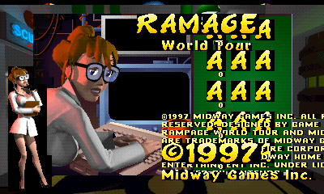
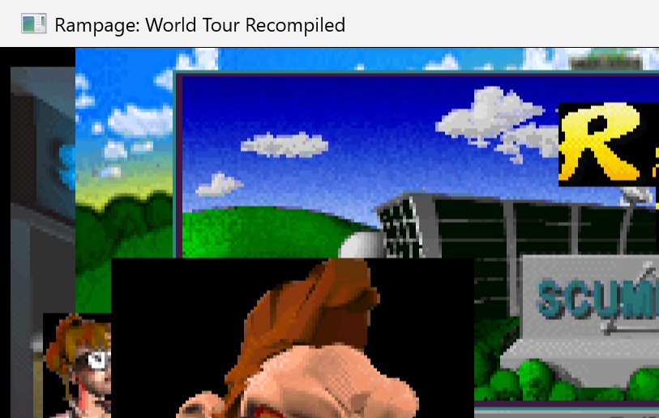
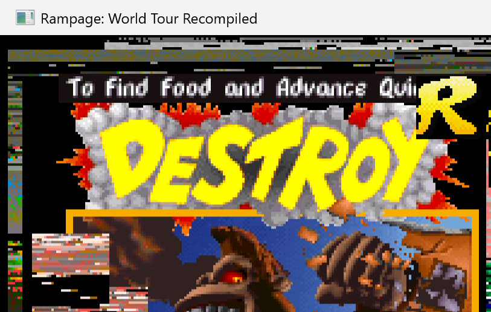

# Rampage: World Tour Recompiled

A PC port of **Rampage World Tour** (N64, 1997) and **Rampage 2: Universal Tour** (N64, 1999) using static recompilation via [N64Recomp](https://github.com/Mr-Wiseguy/N64Recomp).

## Current Status

**Phase 5: Runtime Integration** - The game boots, renders at 60fps via RT64 D3D12, accepts keyboard/controller input, and reaches full in-game gameplay. Visual artifact investigation is in progress.

### What Works
- Full static recompilation of both ROMs (World Tour: 3,736 functions, Rampage 2: 4,788 functions)
- Game boots and renders via RT64 (D3D12/Vulkan) at 4x native resolution (1600x960)
- Stable 60fps VI refresh rate
- Complete game state progression: title -> instructions -> menus -> character select -> **gameplay**
- Keyboard and controller input fully functional
- SDL2 window with gamepad support
- VI register configuration (400x240 framebuffer, xScale=1.6, double-buffered)
- RDRAM framebuffer dumps confirmed correct (raw pixel data matches expected game content)
- Frame-level diagnostic system for RDP command analysis

### What Doesn't Work Yet
- **Audio** - Midway's proprietary SN64 sound engine not yet implemented (ROM audio bank identified at offset 0x906290)
- **Visual artifacts** - Top-edge corruption and left-side misalignment in the VI presentation pipeline. Root cause investigation in progress: the GPU-rendered framebuffer pixels are correct, but the presentation to the display window introduces artifacts. The game uses ~453 CI8 TextureRect COPY-mode draws per frame with a non-standard 400x240 framebuffer.
- Controller pak save/load (low-level PFS stubs not implemented)
- 30 ignored functions in World Tour may cause missing functionality

### Rendering Architecture
Unlike most N64 games, Rampage World Tour does **not** use RSP 3D triangle rendering. The game performs all scene rendering on the CPU and draws the result to the framebuffer using RDP TextureRect commands (~453 per frame in CI8 COPY mode). This software-rendered approach with a non-standard 400x240 framebuffer (vs the typical 320x240) presents unique challenges for RT64 integration.

Key rendering details:
- **CI8 palettized textures** with TLUT palette at TMEM offset 256
- **COPY cycle mode** exclusively (no 1-cycle/2-cycle blending)
- **Double-buffered framebuffers** at RDRAM 0x001A5EC0 / 0x001770C0
- **fillRect (0,0)-(399,239)** clears the full framebuffer each frame
- Resolution scaled to 4x native (1600x960) by RT64's WindowIntegerScale

## Screenshots

### RDRAM Framebuffer Dump (Raw Pixel Data)


*Raw RDRAM framebuffer dump at 400x240 - confirms the RDP rendering pipeline produces correct pixels.*

### In-Game Gameplay


*George the gorilla in gameplay - buildings, sky, and environment rendering at 60fps. Note visual artifacts at top and left edges.*

### Title Screen


*The instructions/menu screen with monster artwork.*

## Building

### Requirements
- Windows 10/11
- LLVM/Clang (clang-cl)
- Visual Studio 2022 (for MSVC environment/libraries)
- Ninja build system
- CMake 3.20+
- N64 ROM files (not included)

### Build Steps
```bash
# Full build
cmd.exe /c "D:\rampage\_build_run.bat"

# Clean rebuild
cmd.exe /c "D:\rampage\_build_run.bat" clean
```

The build produces `build/RampageRecompiled.exe`.

### Running
Place your ROM file as `rampage_wt.z64` in the working directory. The game will auto-detect and validate the ROM on first launch.

## Architecture

Built on the [N64ModernRuntime](https://github.com/sonicdcer/N64ModernRuntime) framework (same approach as Zelda 64 Recomp / Quest64 Recomp):

- **N64Recomp** - Static MIPS-to-C recompilation
- **RT64** - N64 RDP GPU emulation via D3D12/Vulkan
- **ultramodern** - N64 OS function reimplementation (threads, scheduling, memory)
- **librecomp** - Runtime for loading and executing recompiled code
- **RmlUi** - Launcher/config UI framework

## Project Structure

```
src/main/          - Entry point, SDL window, audio, game registration
src/game/          - Input, config, controls, debug, recomp APIs
src/ui/            - UI system (RmlUi-based)
RecompiledFuncs_WT/ - 3,736 recompiled World Tour functions
RecompiledFuncs_R2/ - 4,788 recompiled Rampage 2 functions
rsp/               - RSP audio stub (not yet implemented)
symbols/           - Function symbol tables for both ROMs
tools/             - Python utilities for fixing recompilation issues
tools/simple64/    - N64 emulator for reference frame comparison
scripts/           - Build, capture, and diagnostic helper scripts
screenshots/       - Game screenshots and diagnostic captures
```

## License

This project is for educational and preservation purposes. Original game assets are not included.
