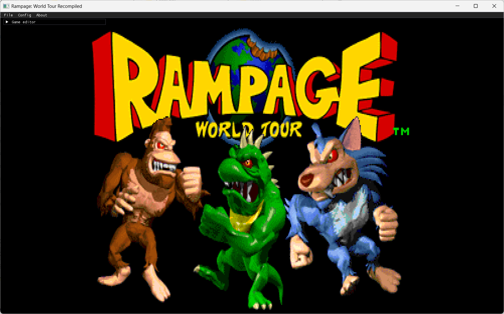
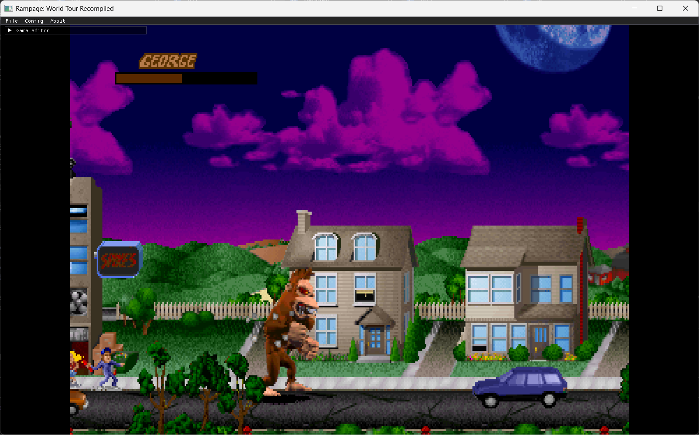
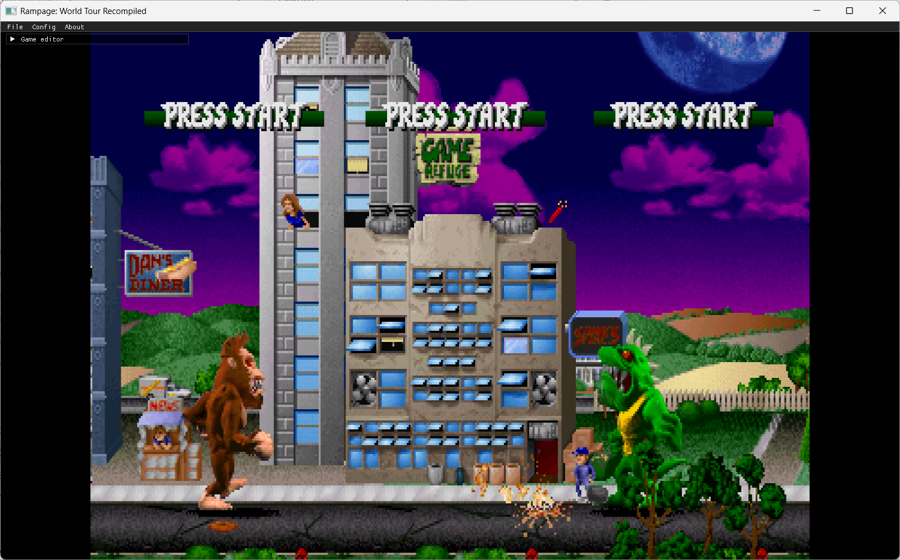

# Rampage: World Tour Recompiled

A PC port of **Rampage World Tour** (N64, 1997) and **Rampage 2: Universal Tour** (N64, 1999) using static recompilation via [N64Recomp](https://github.com/Mr-Wiseguy/N64Recomp).

## Current Status

**Phase 5: Runtime Integration** - The game is fully playable with working controls. Boots, renders at 60fps via RT64 D3D12, accepts keyboard/controller input, and plays through all game states including gameplay.

### What Works
- Full static recompilation of both ROMs (World Tour: 3,736 functions, Rampage 2: 4,788 functions)
- Game boots and renders via RT64 (D3D12/Vulkan) at 4x native resolution (1600x960)
- Stable 60fps VI refresh rate
- Complete game state progression: title -> instructions -> menus -> character select -> **gameplay**
- **Gameplay controls fully functional** - move, punch, kick, jump, climb buildings
- Keyboard and controller input (SDL2 gamepad support)
- Demo mode plays automatically when idle
- VI register configuration (400x240 framebuffer, xScale=1.6, double-buffered)
- Audio initialization (Midway SN64 engine stubs, ROM DMA, audio thread running)
- 418 N64Recomp fallthrough functions automatically fixed
- Render thread race condition resolved (NULL task pointer guard)
- Button mapping tables force-refreshed every frame (game init clears them during state transitions)

### What Doesn't Work Yet
- **Audio output** - Midway's proprietary SN64 sound engine initialized but aspMain is diagnostic-only (no actual sound)
- **Screen transitions** - Fade/wipe effects partially fixed with timer flag bypass; full fix requires SN64 audio timer callbacks
- **Sprite transparency edge cases** - CI8 COPY mode alpha discard implemented; most sprites correct but some edge cases remain
- Controller pak save/load (PFS stubs not implemented)

### Default Controls
| Key | N64 Button | Gameplay Action |
|-----|-----------|-----------------|
| Enter | START | Pause/Start |
| Space | A | Punch |
| Left Shift | B | Kick |
| WASD | Analog Stick | Move |
| Arrow Keys | C Buttons | Jump (C-Down) |
| IJKL | D-Pad | Direction |

## Screenshots

### Title Screen


*Rampage World Tour title screen running at 60fps via RT64 D3D12.*

### Gameplay


*In-game gameplay with George climbing a building, running at 60fps with sprite transparency.*

### Demo Mode


*Demo mode plays automatically when idle at the title screen, showing all three monsters.*

### N64Recomp Fallthrough Bug

N64Recomp incorrectly splits continuous MIPS code at function boundaries, creating small "fallthrough" functions that load registers or perform arithmetic but never call the next function. This causes:

1. **Simple fallthroughs** (418 found) - Function sets up registers then should continue to the next function. Fixed automatically by `tools/fix_fallthroughs_v2.py` which adds a call to the next function.

2. **hi/lo register fallthroughs** (3 found) - Function performs `multu`/`divu` then falls through. The callee gets fresh `hi=0, lo=0` local variables, losing the computation. Fixed manually by recomputing the multiply/divide at the start of the callee.

3. **Render thread race condition** - The scheduler thread (`func_80060BEC`, priority 19) writes a task pointer that the render thread (`func_800611A0`, priority 17) reads. On N64, cooperative scheduling ensures the higher-priority scheduler runs first. In the recompiled version with preemptive OS threads, the render thread can wake before the pointer is set. Fixed with NULL guards.

### Rendering Architecture
Unlike most N64 games, Rampage World Tour does **not** use RSP 3D triangle rendering. The game performs all scene rendering on the CPU and draws the result to the framebuffer using RDP TextureRect commands (~453 per frame in CI8 COPY mode). This software-rendered approach with a non-standard 400x240 framebuffer (vs the typical 320x240) presents unique challenges for RT64 integration.

Key rendering details:
- **CI8 palettized textures** with TLUT palette at TMEM offset 256
- **COPY cycle mode** exclusively (no 1-cycle/2-cycle blending)
- **Double-buffered framebuffers** at RDRAM 0x001A5EC0 / 0x001770C0
- **fillRect (0,0)-(399,239)** clears the full framebuffer each frame
- Resolution scaled to 4x native (1600x960) by RT64's WindowIntegerScale

## Building

### Requirements
- Windows 10/11
- LLVM/Clang (clang-cl)
- Visual Studio 2022 (for MSVC environment/libraries)
- Ninja build system
- CMake 3.20+
- N64 ROM files (not included)

### Build Steps
```bash
# Full build
cmd.exe /c "D:\rampage\_build_run.bat"

# Clean rebuild
cmd.exe /c "D:\rampage\_build_run.bat" clean
```

The build produces `build/RampageRecompiled.exe`.

### Running
Place your ROM file as `rampage_wt.z64` in the working directory. The game will auto-detect and validate the ROM on first launch.

## Architecture

Built on the [N64ModernRuntime](https://github.com/sonicdcer/N64ModernRuntime) framework (same approach as Zelda 64 Recomp / Quest64 Recomp):

- **N64Recomp** - Static MIPS-to-C recompilation
- **RT64** - N64 RDP GPU emulation via D3D12/Vulkan
- **ultramodern** - N64 OS function reimplementation (threads, scheduling, memory)
- **librecomp** - Runtime for loading and executing recompiled code
- **Dear ImGui** - Menu bar overlay (File/Config/About) via RT64's built-in Inspector

## Project Structure

```
src/main/          - Entry point, SDL window, audio, game registration
src/game/          - Input, config, controls, debug, recomp APIs
src/ui/            - UI system (RmlUi-based)
RecompiledFuncs_WT/ - 3,736 recompiled World Tour functions
RecompiledFuncs_R2/ - 4,788 recompiled Rampage 2 functions
rsp/               - RSP audio stub (not yet implemented)
symbols/           - Function symbol tables for both ROMs
tools/             - Python utilities for fixing recompilation issues
scripts/           - Build, capture, and diagnostic helper scripts
screenshots/       - Game screenshots and diagnostic captures
```

## License

This project is for educational and preservation purposes. Original game assets are not included.
